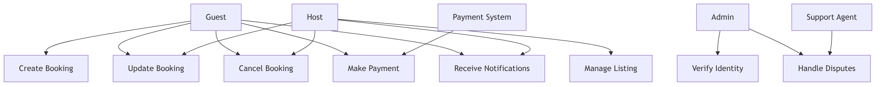

# Requirement Analysis in Software Development

This repository contains the detailed Requirement Analysis for a Booking Management System. It demonstrates how to gather, document, and structure system requirements in the software development lifecycle (SDLC) to ensure successful project execution.

---

## What is Requirement Analysis?

Requirement Analysis is a critical phase in the Software Development Life Cycle (SDLC) that focuses on understanding and defining the needs of a system from the perspective of stakeholders.  
It involves identifying what the system should do, documenting these requirements, and establishing clear guidelines for the development team.  

**Importance in SDLC:**
- Ensures developers understand the exact needs of users and business.
- Reduces errors and rework during development.
- Provides a clear roadmap for design, coding, testing, and deployment.

---

## Why is Requirement Analysis Important?

Requirement Analysis is crucial because:

1. **Clarity and Understanding:** Ensures stakeholders and developers share a common understanding of the system requirements.
2. **Cost and Time Efficiency:** Identifying requirements early reduces costly changes during later development stages.
3. **Improved Quality:** Helps design a system that meets user expectations and business goals, minimizing defects.
4. **Facilitates Planning:** Provides a foundation for project planning, estimation, and resource allocation.

---

## Key Activities in Requirement Analysis

The main activities involved in Requirement Analysis include:

- **Requirement Gathering:** Collecting requirements from stakeholders using interviews, surveys, and observations.
- **Requirement Elicitation:** Clarifying and understanding the collected requirements to ensure completeness.
- **Requirement Documentation:** Writing structured documentation for all requirements for reference throughout the project.
- **Requirement Analysis and Modeling:** Analyzing requirements for feasibility, consistency, and designing models like use case diagrams.
- **Requirement Validation:** Ensuring requirements meet stakeholder needs and are achievable within project constraints.

---

## Types of Requirements

### Functional Requirements
Functional requirements define the specific behavior or functions of the system.  
**Examples for Booking Management System:**
- Users can create a new booking.
- Users can update or cancel a booking.
- Admin can generate booking reports.
- System sends notifications upon successful booking.

### Non-functional Requirements
Non-functional requirements define system qualities and constraints.  
**Examples for Booking Management System:**
- System should load the booking page in less than 2 seconds.
- System must be available 99.9% of the time.
- User data must be securely stored and comply with data protection regulations.
- The interface should be accessible on desktop and mobile devices.

---

## Use Case Diagrams

Use Case Diagrams are visual representations of system interactions between actors (users, admins) and the system itself. They help to identify the functionality the system must provide and its stakeholders.

**Benefits:**
- Clearly shows interactions and responsibilities.
- Simplifies complex system requirements.
- Provides a visual reference for stakeholders and developers.

**Use Case Diagram for Booking System:**

**Actors:**
- Guest(Customer)
- Host
- Admin
- Payment Gateway
- Support Agent / Customer Service 

**Use Cases:**
- Create Booking
- Update Booking
- Cancel Booking
- Make Payment
- Generate Reports
- Receives Notification
- Assist Users/Resolve Issues

---

## Acceptance Criteria

Acceptance Criteria define the conditions that a system or feature must meet to be accepted by stakeholders. They ensure that requirements are testable, measurable, and meet business needs.

**Example: Checkout Feature Acceptance Criteria**
- Users can select booking options and proceed to payment.
- Payment confirmation is received via email and SMS.
- Booking status updates to "Confirmed" after successful payment.
- System handles payment failures and displays appropriate error messages.

---
